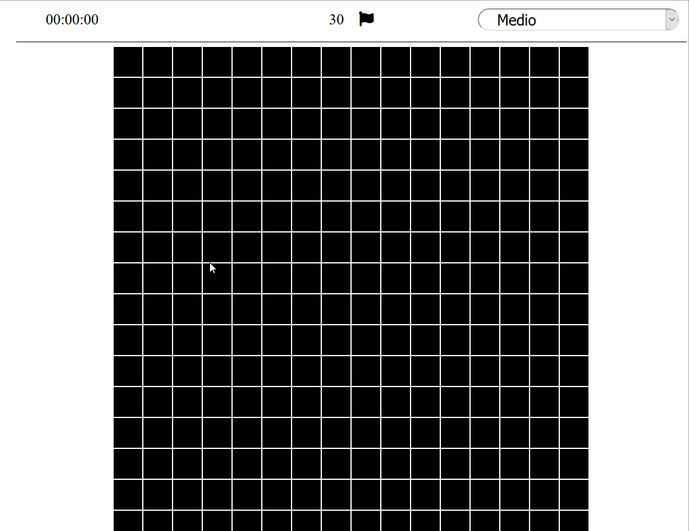
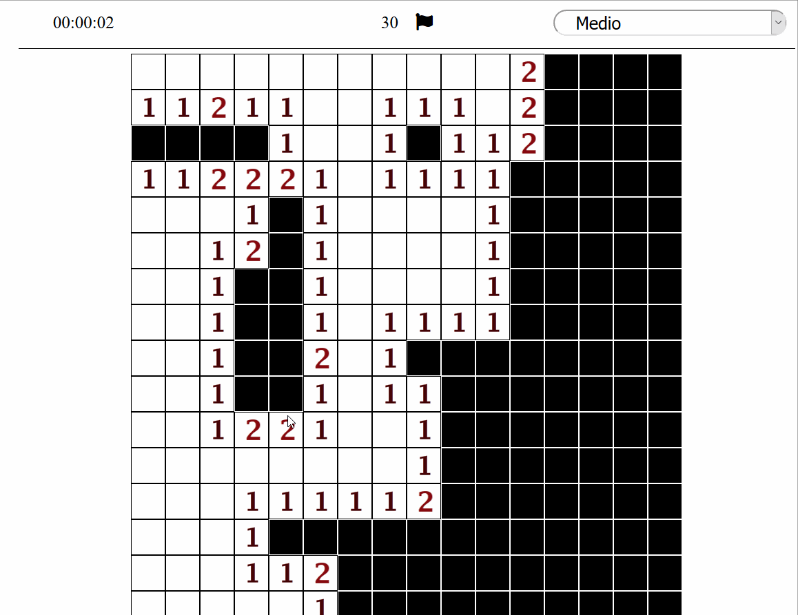
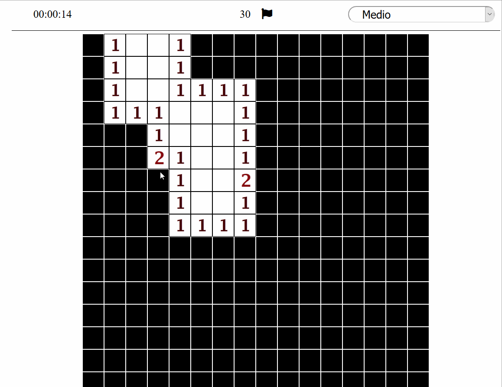

# :bomb: Buscaminas Con jQuery :bomb:

## Por Marcos Gallardo Pérez

Se trata del mítico juego del buscaminas hecho con javascript y jQuery. El juego se diseña en dos capas, una con javascript puro donde definimos el comportamiento del buscaminas y otra con jQuery donde hacemos uso del comportamiento creado en la primera capa para mostrarlo al usuario.

------------

 ### Demo [aquí](https://markweell.github.io/BuscaminasjQuery/)

------------

------------

 ### Funcionalidades:

------------
:game_die: **Picar**: (Botón izquiero ratón) muestra el contenido de una casilla. Si picas sobre una casilla que contiene una mina perderías.

:game_die: **Marcar**: (Botón derecho ratón)Marca una casilla con una bandera. La utilidad de esto es marcar casillas que creamos que contengan minas.

:game_die: **Descubrir**: (Botón derecho y izquierdo a la vez). Cuando tengas marcadas las minas de alrededor de una casilla, se puede usar para descubrir las casillas adyacentes. Si estan mal marcadas las minasl, perderías.

